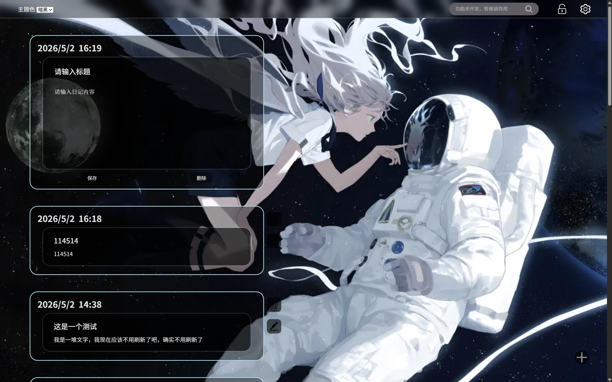

<ul>
<h2>功能介绍</h2>
<li>一个在本地运行的日记</li>
<li>可以增删查改</li>
<li>可以锁屏</li>
<li>可以设置背景图片</li>
</ul>

<ol>
<h2>使用方法</h2>
<li>从仓库下载文件</li>
<li>下载Vscode</li>
<li>打开Vscode并下载插件Live Server</li>
<li>使用Vscode打开下载好的文件夹</li>
<li>在index.html中点击界面右下角的Go Live</li>

 

如果你是初次使用的Vscode，

请在网上自行寻找有关Vscode的教程，

这里不展开细讲。(教程不会多复杂的，你无需担心)

<li>一切正常的话就会在你的浏览器上打开日记了</li>
</ol>

<ol>
<h2>注意事项</h2>
<li>更改日记位置后得刷新才会生效</li>
<li>数据存放在浏览器的localStorage里面，不要误删</li>
</ol>

<h2>网站的示例图如下</h2>

